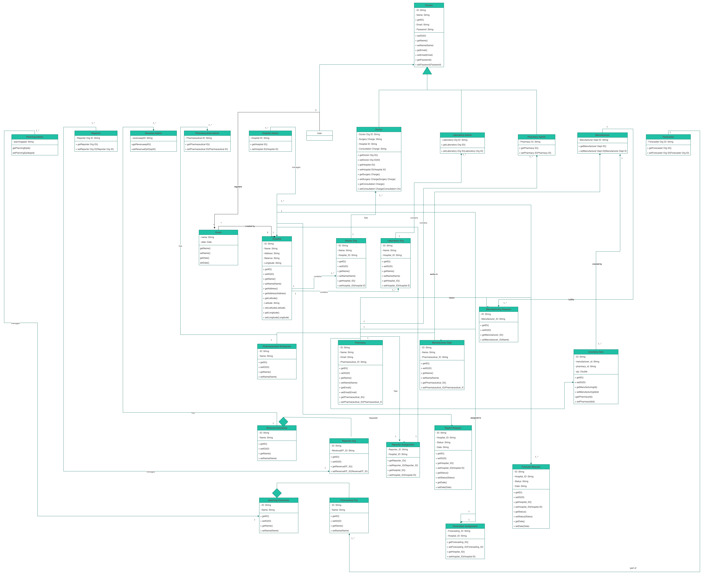
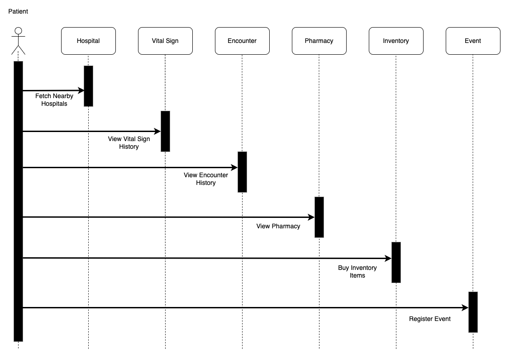
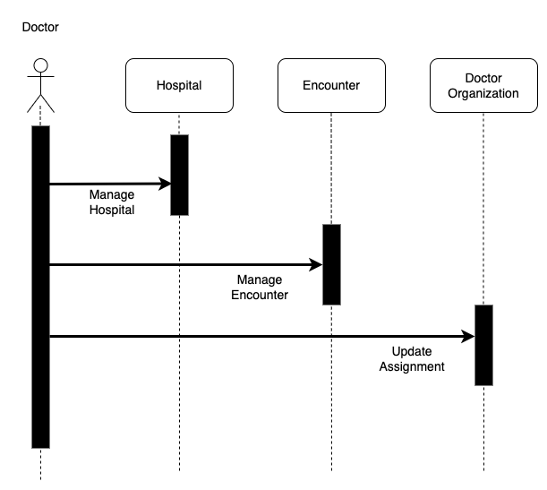
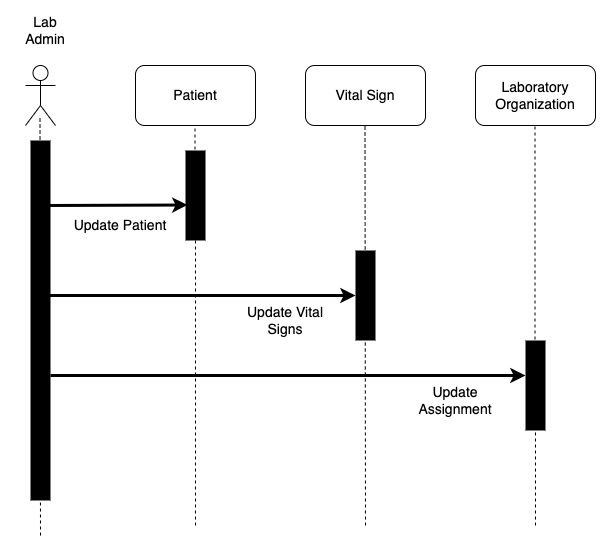
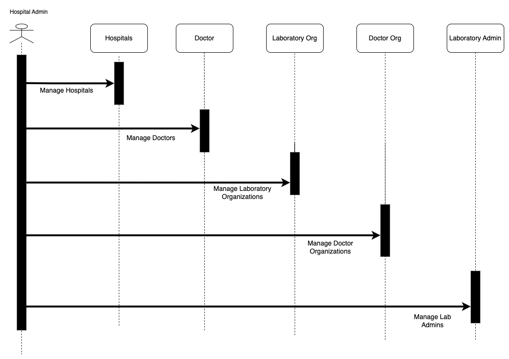
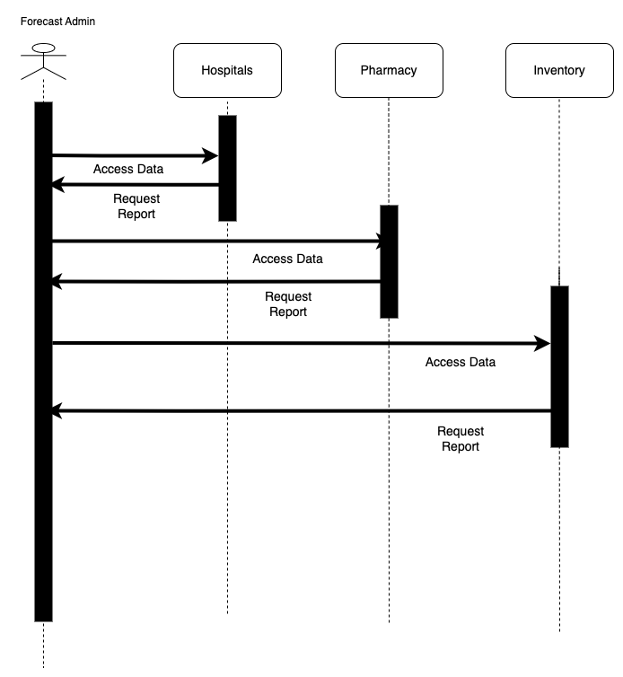
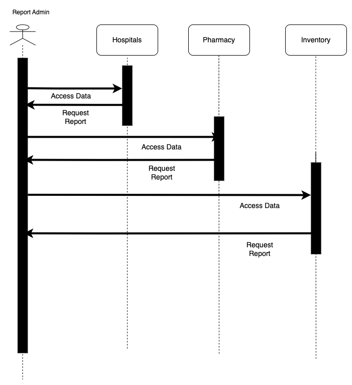
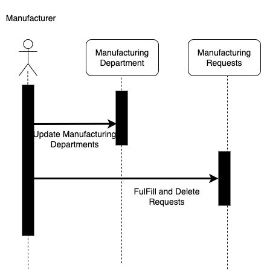
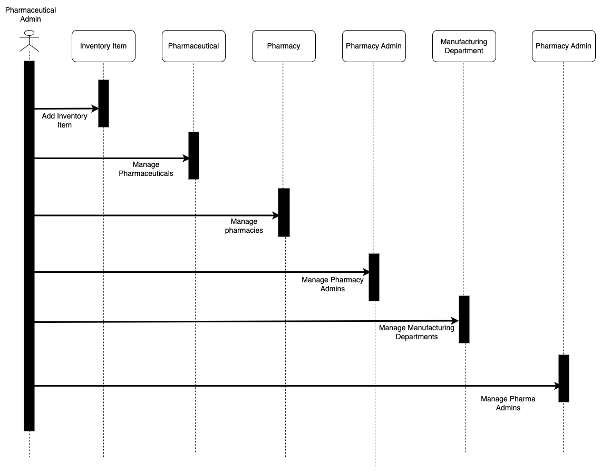
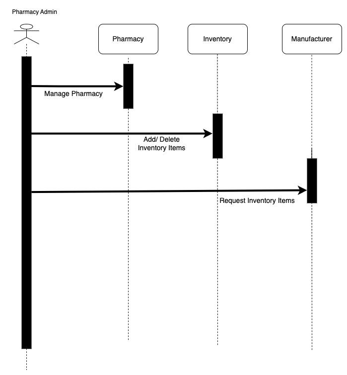

# Soul Saver

### An Enterprise Management System

Our Enterprise Management Solution is a platform where major problems of Hospitals, Pharmaceuticals, Revenue and planning enterprises are addressed.

We offer solution involving 4 enterprises

1. Hospital
2. Pharmaceutical
3. Revenue
4. Planning

In Hospital enterprise, we add following organisations

1. Doctors Organisation

This is comprised of Doctors who are core part of Hospital enterprise
Doctor can attend the encounter an diagnose patient. Also Doctor can perform surgery in this encounter. 

Hospital earns revenue with this encounters.

2. Laboratory Oraganisation

Lab Admins works in a Laboratory organisation and adds vital signs to user

In Pharmaceutical Enterprise, We have following organisations

1. Manufacturing department 

Manufacturers are organised into a manufacturing department. Manufacturers produce Inventory items and sells in a pharmacy

2. Pharmacy Organisation

Manufactured Inventory items are sold and associated with pharmacy. Revenue of pharmacy is calculated with the transactions between user and pharmacy

In Revenue enterprise the organisations are :

1. Reporter Orgsnisation

Reporter organisation comprises of Reporters. Reporter is assigned with a hospital and pharmacy. The reporter access data of assigned hospitals and pharmacies. 

Reporter sends reports for the requests received by hospitals

In Planning enterprise the organisations are :

1. Forecaster Orgsnisation

Forecaster organisation comprises of Forecasters. Forecaster is assigned with a hospital and pharmacy. The forecaster access data of assigned hospitals and pharmacies. He gives the revenue forecast for 3/5/10 years to requests received from hospitals.

For each Enterprise, we have respective admins who can manage the workflow.

# Class Diagram

# Sequence diagrams

